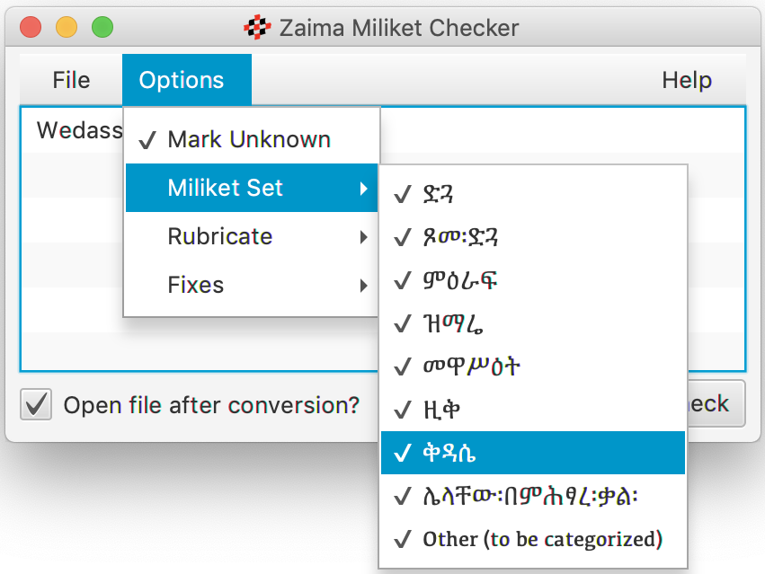
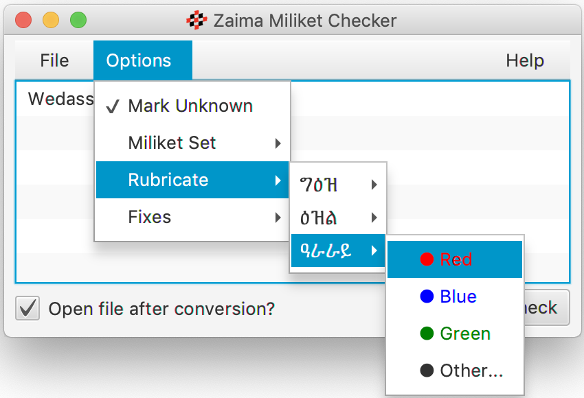

# Zaima Miliket Checker

## About
The Zaima Miliket Checker is a utility for reviewing Yaredian Zaima Miliket formatted in "Ruby Text" (aka "Phonetic Guide" text)
in Microsoft Word documents.  The checker uses a library of identified miliket to then look for an unrecognized miliket which
may represent a typographical error.  The checker can make some formatting corrections that can occur when working with Ruby
based layout.  It can also rubricate miliket as per its silt (ስልት) in any color available.

The miliket sets used by the checker have been compiled from the works of _ታላቁ፡ኢትዮጵያዊ፡ሊቅ፡ቅዱስ፡ያሬድና፡የዜማው፡ታሪክ፡ከነምልክቱ
(መስከረም ፩ ቀን ፳፻፲) by ሊቀ መዝምራን ሞገስ ሥዩም (Liqa Mezemran Moges Seyoum) and
and _የቅስዱ ያሬድ ታሪክና የዜማው ምልክቶች_ (ግንቦት ፲፭ ቀን ፲፱፻፶፱ ዓ.ም.)_ by አክሊለ ብርሃን ወልደ ቂርስቆ (Aklile Birhan Weldekirkos).  The
sets are being continually refined and updated.  Currently just over 600 miliket are recognized whose serayu (ሥረዩ) are found
in:

* ድጓ (169)
* ጾመ፡ድጓ (121)
* ምዕራፍ (248)
* ቅዳሴ (30)
* ዚቅ (1)
* ዝማሬ (12)
* መዋሥዕት (8)
* ሌላቸው፡በምሕፃረ፡ቃል (26)

## Download

* [Direct download of v0.4 here.](https://github.com/geezorg/ZaimaChecker/releases/download/v0.4.0/ZaimaChecker-0.4.0-full-gui.jar)
* [Read the notes on the latest updates.](https://github.com/geezorg/ZaimaChecker/releases/tag/v0.4.0)

## Usage & Options
The Zaima Miliket Checker will scan selected .docx files and examine miliket found in "Ruby Text" (aka "Phonetic Guide" text).
The checker will produce an output file using the original name as the source file with "-Checked" appended to the file name.
The "-Checked" file will contain corrections and enhancements as chosen under the "Options" menu.  The source files are not
modified.

### Mark Unknown
When selected the checker will color any unrecognized miliket with red.

### Miliket Sets
By default, all miliket collections are used for validation.  One or more miliket collections may be unselected as desired:

### Rubricate
The miliket checker can set the font color of miliket as desired for a given silt (ስልት).  This feature can be used in
combination with the *Miliket Set* selections:

### Fixes

### Limitations

The checker ...

Issues can be reported to the author directly, or via the GitHub [issues tracker](https://github.com/geezorg/ZaimaChecker/issues)
for the project.

### Troubleshooting

If nothing happens when you double click the "ZaimaChecker-0.4.0-full-gui.jar" file, and you are certain that
Java is installed on your Windows system, you likely need to fix the Window's registry.  Try downloading and launching
[Jarfix](https://johann.loefflmann.net/en/software/jarfix/) to fix the registry.
